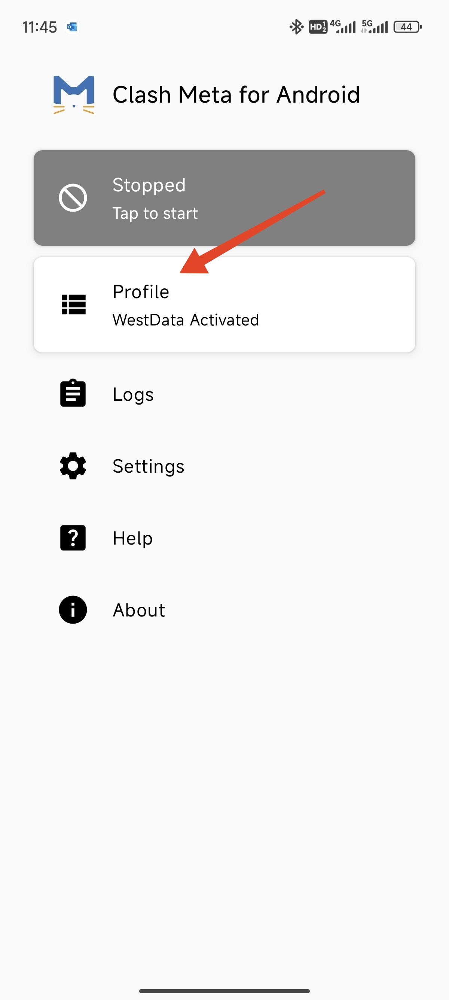
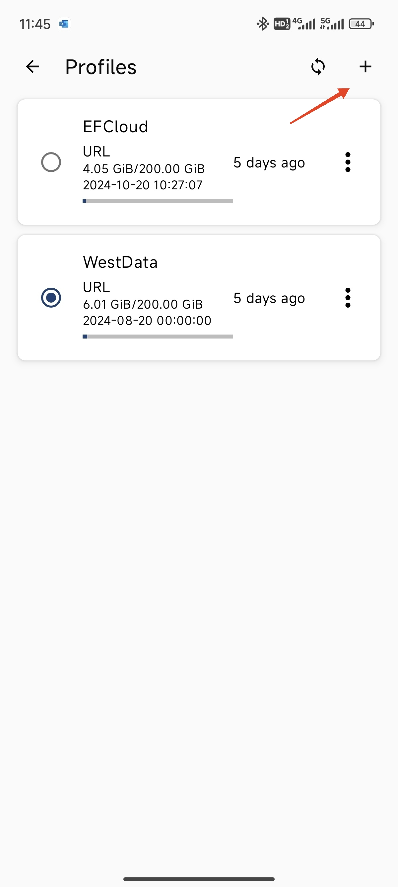
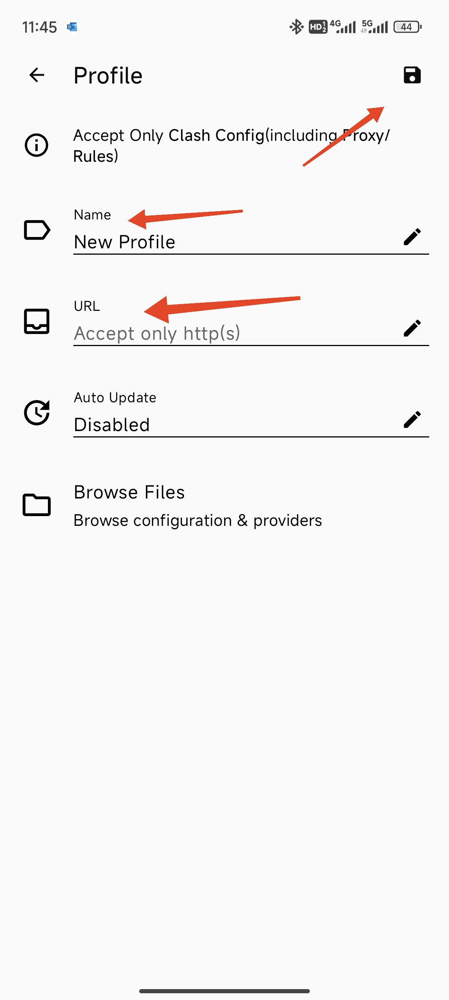
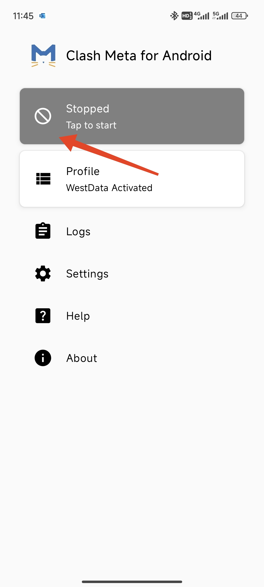

## 前言

在开始提升英语水平之前，先了解一些基础知识会有很大帮助。

### 信息安全

无论何时从互联网或外界存储设备下载任何文件都要小心是否可能带有病毒，不论文件来源。养成良好的上网习惯非常重要。

下载软件时，应注意从官方网站下载，避免使用盗版软件。是否为官方网站可以查看网址，正规的网址往往赏心悦目，比如本站网址2333

本次提供的clash for android来自GitHub，软件内携带病毒的可能性较低。但是我们最好还是检查是否安全再安装。

安全报告：

https://www.hybrid-analysis.com/sample/340c82ccc7e96712f1c608f821542447529bdad50426c897ee1077f080b8460a

https://www.virscan.org/report/340c82ccc7e96712f1c608f821542447529bdad50426c897ee1077f080b8460a

https://www.virustotal.com/gui/file/340c82ccc7e96712f1c608f821542447529bdad50426c897ee1077f080b8460a/detection

### 国际互联网

众所周知，我国的互联网通过长城防火墙（Great FireWall，简称GFW）阻断了对个别国际互联网站点的连接。科学上网也就是绕过这一限制的过程。

需要注意的是，GFW并非无条件阻拦一切外网访问行为，比如它采用黑名单制度，只有黑名单上的网站才是无法直接访问的，其他网站则不受影响。但是受制于网速，依然有可能加载失败

## Clash的使用

科学上网的服务商提供多样的服务方式，某些服务商要求下载他们提供的软件，存在一定安全风险。因此，我们选择以获得订阅的方式实现科学上网。

Clash for Android是一款开源发布在GitHub上的第三方软件，在界内具有广泛的影响力，其本身并不能实现科学上网，而是通过获取订阅的方式得到服务商的服务。

以下是如何使用Clash：

- 进入首页，点击`Profile`，再点击右上角的`+`新建配置
- 选择`URL`
- 编辑名字，在`URL`栏粘贴订阅链接，点击保存
- 按照软件提示完成后续操作
- 点击`Tap to Start`，开始科学上网

需要注意的是，订阅链接是类似密码一样重要的存在，这是你对服务商的服务凭证，因此不可分享给他人。

至此，你已经可以开始学习英语。