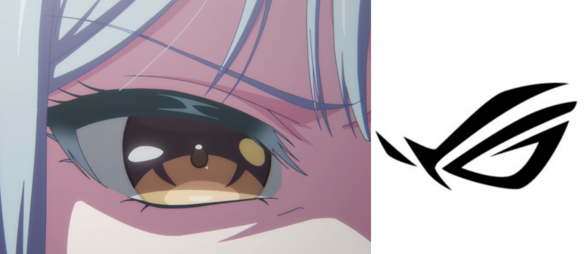

## 多人格悖论

Mutsumi作为主人格，是大部分时间下躯体的控制者，所以是「若叶睦」的正统人格。
但是Mortis作为与Mutsumi共生的人格之一，她的存在，抑或是不存在，到底哪个才是“正确”的呢……

如果Mortis在此后接管Mutsumi成为主人格，从「若叶睦」的朋友的角度来说，Mortis是“杀害”Mutsumi的凶手，
但从Mortis的角度来说，她只不过是不希望自己这个人格消失而已。

## TGW集团下属ASUS下属Republic of Gamers

Saki也是很帅的（笑）

