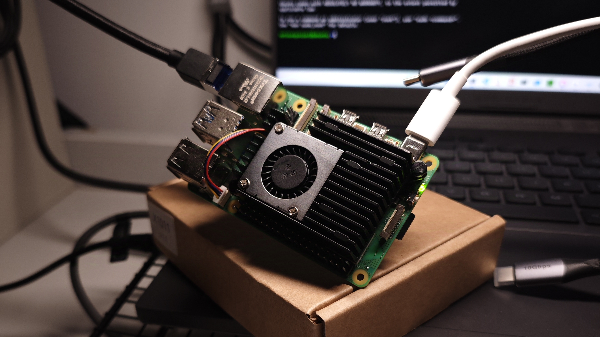

最近买了块树莓派5，好玩，爱玩。但是4K解码有点吃力。

注：以下内容均通过ssh实现，默认无图形界面，默认普通用户，通过sudo提权



## Ubuntu基本设置

以下步骤帮助我们搭建基础环境。

### Netplan编辑

Once ssh connected, run

```bash
$ sudo nano /etc/netplan/01-<file-name>.yaml
```

 > `.yaml` 文件对缩进格式非常敏感，应小心编辑

修改Netplan可以方便我们管理路由表。

### 为Pi加装SSD

1. **获取驱动器信息**

```bash
$ sudo fdisk -l
```

2. **分区**

假设安装的SSD名称为`nvme0n1`，通过`fdisk`来为SSD分分区。

```bash
$ sudo fdisk /dev/nvme0n1
```

>- 按`n`新建分区
>- 无特殊要求，选择`primary`
>- 再次按`n`可多次新建分区
>- 按`w` 退出`fdisk`
  
1. **格式化分区**

假设新建分区为`/dev/nvme0n1p1`，通过`mkfs`命令格式化分区并设置文件系统。

例如，为分区配置ext4文件系统：

```bash
$ sudo mkfs.ext4 /dev/nvme0n1p1
```

4. **挂载新分区**

为分区建立挂载点并挂载：

```bash
$ sudo mkdir /mnt/mydisk
$ sudo mount /dev/nvme0n1p1 /mnt/mydisk
```

5. **自动挂载**

编辑`fstab`以实现自动挂载：

```bash
sudo nano /etc/fstab
```

在文件末尾添加：

```text
/dev/nvme0n1p1 /mnt/mydisk ext4 defaults 0 0
```

保存并退出。运行以下命令检查有无错误：

```bash
$ sudo mount -a
```

 > 如果一切正常则无输出

## 搭建开发环境

下面为开发和生产搭建环境

### 安装Nginx

1. **下载Nginx**

```bash
$ sudo apt update
$ sudo apt install nginx
```

1. **启动服务**

```bash
$ sudo systemctl start nginx
$ sudo systemctl enable nginx
$ sudo ufw allow 'Nginx Full'
```

3. **修改Nginx的用户权限**

修改权限防止Nginx无法访问服务器的服务

```bash
$ sudo chown -R $USER:$USER /var/www/mywebsite
$ sudo chmod -R 755 /var/www/mywebsite
```

1. **配置Nginx虚拟主机**

进入`/etc/nginx/sites-available`，为网页新建配置文件：

```bash
$ sudo nano /etc/nginx/sites-available/mywebsite
```

在文件中添加配置信息，例如：

```conf
server {
    listen 80;
    server_name mywebsite.com www.mywebsite.com;

    root /var/www/mywebsite;
    index index.html;

    location / {
        try_files $uri $uri/ =404;
    }
}
```

保存并检查：

```bash
$ sudo ln -s /etc/nginx/sites-available/mywebsite /etc/nginx/sites-enabled/
$ sudo nginx -t
$ sudo systemctl reload nginx
```

### 安装Miniforge3

据说`Miniforge3`比conda更适用于arm芯片

1. **下载Miniforge3**

从Github下载：

```bash
$ wget https://github.com/conda-forge/miniforge/releases/latest/download/Miniforge3-Linux-aarch64.sh
```

2. **安装Miniforge3**

为刚才下载的shell脚本赋予可执行权限：

```bash
$ chmod +x Miniforge3-Linux-aarch64.sh
$ ./Miniforge3-Linux-aarch64.sh
```

跟着指示完成安装，最后的conda环境那块有点绕，不行就多装几遍试错（其实也有命令可以更改conda相关配置）

3. **激活Conda环境**

如果一切正常，现在就可以激活conda环境：

```bash
$ source ~/.bashrc
```

不出意外的话，Conda就被激活了。

## 一些小工具

记录一下一些好用的工具

### 高速下载器Gopeed

[Gopeed](https://github.com/GopeedLab/gopeed, "https://github.com/GopeedLab/gopeed")，俗称`狗屁下载器`，底层由Golan编写，多线程并发下载，支持多种协议，可以下载torrent、magnet和普通文件，但是由于该下载器并非以种子下载为本职工作，且由于受pcdn影响，非qBittorent等传统bt客户端容易被误杀，因此不建议作为bt下载器使用。但是非常适合下载其他普通文件。

以下是适用于树莓派的arm64版本（版本可能不是最新，去github找找最新的就行）：

[arm46 version](https://github.com/GopeedLab/gopeed/releases/download/v1.5.9/gopeed-web-v1.5.9-linux-arm64.zip, "Github release, click to download.").

安装方法如下：

```bash
$ # Download software
$ wget https://github.com/GopeedLab/gopeed/releases/download/v1.5.9/gopeed-web-v1.5.9-linux-arm64.zip


$ # Unzip
$ unzip gopeed-web-v1.5.9-linux-arm64.zip


$ cd gopeed-web-v1.5.9-linux-arm64
$ chmod +x gopeed
$ ./gopeed
```

通过http://localhost:9999访问gopeed
