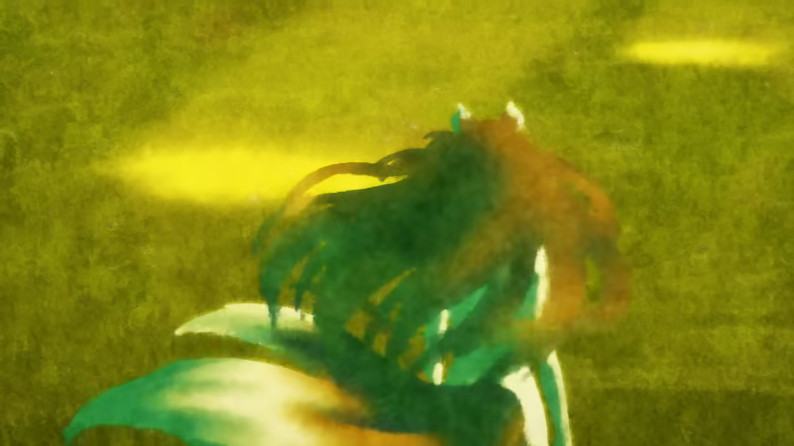

## Hello World

Hello!

こんにちは！

你好！

## Code Blocks

```rust title = "Trapping-Rain-Water"
use std::cmp::max;
use std::cmp::min;

impl Solution {
    pub fn trap(height: Vec<i32>) -> i32 {
        let n: usize = height.len();
        let mut amount: i32 = 0;
        let mut left_max: Vec<i32> = vec![0; n];
        let mut right_max: Vec<i32> = vec![0; n];
        
        left_max[0] = height[0];
        right_max[n-1] = height[n-1];


        for i in 1..n   {
            left_max[i] = max(left_max[i-1], height[i]);
        }

        for i in (0..n-1).rev()    {
            right_max[i] = max(right_max[i+1], height[i]);
        }

        for i in 0..n   {
            amount += min(right_max[i], left_max[i])- height[i];
        }

        amount

    }
}


```

## Image


